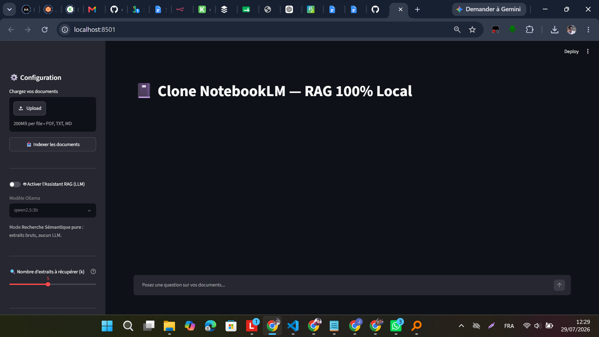

# 📓 Clone NotebookLM — Système RAG 100% Local

Application **RAG (Retrieval-Augmented Generation)** entièrement locale, développée en Python.
Elle permet de charger ses propres documents (PDF, Markdown, TXT) et d'interagir avec eux de
façon intelligente — **sans aucun appel à une API externe** (confidentialité totale, 100% local).

**Stack :** Streamlit · LangChain · ChromaDB · sentence-transformers · Ollama (LLM local)

---

## 🖼️ Aperçu

| Interface | Recherche sémantique (sans LLM) |
|---|---|
|  |  |

| Extraits retournés | Réponse générée par le LLM local |
|---|---|
|  |  |

| Contexte utilisé (transparence) | Garde-fou anti-hallucination |
|---|---|
|  |  |

---

## ✨ Fonctionnalités

- 📁 Import de documents **PDF, Markdown et TXT**, avec extraction, découpage (chunking) et
  vectorisation automatiques.
- 🔍 **Mode Recherche Sémantique pure** : retourne les passages les plus pertinents d'un
  document, sans faire appel à un LLM.
- 🤖 **Mode Assistant RAG complet** : un LLM local (Ollama) rédige une réponse **strictement**
  basée sur le contenu des documents fournis — avec garde-fou anti-hallucination
  (*"Je ne trouve pas la réponse dans les documents fournis"* si l'information est absente).
- 🎚️ **Curseur k réglable (1 à 10)** : contrôle du nombre d'extraits injectés dans le contexte
  du LLM.
- 🔎 **Transparence totale** : chaque réponse peut être dépliée pour voir les extraits exacts et
  leur fichier source utilisés comme contexte.
- 💾 Persistance de la base vectorielle sur disque (ChromaDB) : les documents indexés restent
  disponibles après un redémarrage de l'application.

---

## 🧱 Architecture (pipeline RAG)

```
Upload (PDF/TXT/MD)
        │
        ▼
[1] Extraction         → PyMuPDFLoader / TextLoader
        │
        ▼
[2] Chunking           → RecursiveCharacterTextSplitter (1000 / overlap 200)
        │
        ▼
[3] Vectorisation      → HuggingFaceEmbeddings (MiniLM multilingue)
        │
        ▼
[4] Stockage           → ChromaDB (avec métadonnées : nom du fichier)
        │
        ▼
   Question utilisateur
        │
        ├── Toggle OFF → renvoie les k chunks les plus proches (recherche MMR)
        │
        └── Toggle ON  → contexte + PromptTemplate strict → LLM Ollama
```

---

## ⚙️ Installation

### 1. Dépendances Python
```powershell
python -m pip install -r requirements.txt
```
> En cas d'erreur SSL (`CERTIFICATE_VERIFY_FAILED`) derrière un proxy/réseau d'entreprise :
> ```powershell
> python -m pip install --trusted-host pypi.org --trusted-host files.pythonhosted.org -r requirements.txt
> ```

### 2. Ollama (le LLM local)
- Télécharger / installer : https://ollama.com/download (ou `winget install Ollama.Ollama`)
- Télécharger un modèle :
```powershell
ollama pull qwen2.5:3b
```
> Le service Ollama doit tourner en tâche de fond pendant l'utilisation du mode RAG.

---

## ▶️ Lancement
```powershell
streamlit run app.py
```
L'application s'ouvre dans le navigateur (http://localhost:8501).

**Utilisation :**
1. Barre latérale → charger un/des fichier(s) → **Indexer les documents**.
2. Poser une question dans la zone de chat.
3. Basculer le **Toggle LLM** pour comparer les deux modes.
4. Ajuster le **curseur k** pour contrôler le nombre d'extraits utilisés.

---

## 🧠 Choix techniques (justifications)

| Choix | Valeur | Pourquoi |
|------|--------|----------|
| **Embeddings** | `paraphrase-multilingual-MiniLM-L12-v2` | Multilingue (gère le FR), léger (~120 Mo), rapide en local. |
| **Chunk size** | 1000 caractères | Assez de contexte pour garder le sens, assez petit pour une recherche précise. |
| **Overlap** | 200 (20%) | Évite de couper une idée entre deux chunks ; une phrase frontière reste retrouvable. |
| **Splitter** | `RecursiveCharacterTextSplitter` | Coupe en priorité aux paragraphes/phrases → chunks propres. |
| **Recherche** | MMR (Maximal Marginal Relevance) | Diversifie les extraits retenus pour éviter les quasi-doublons. |
| **Top-K** | Réglable 1–10 (défaut 5) | Compromis rappel / bruit dans le contexte, ajustable selon le besoin. |
| **Temperature LLM** | 0 | Réponses factuelles, déterministes ; le modèle n'invente pas. |
| **Prompt système** | Strict | Force le LLM à répondre *exclusivement* à partir du contexte fourni. |

---

## 📂 Structure du projet
- `app.py` — code source complet de l'application (commenté).
- `requirements.txt` — dépendances Python.
- `EXPLICATION.md` — explication du code ligne par ligne.
- `screenshoots/` — captures d'écran de l'application.
- `chroma_db/` — base vectorielle persistée (générée localement à l'indexation, non versionnée).
